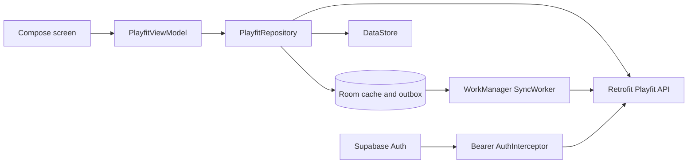

# Architecture

## Scope

The Android client is a native Jetpack Compose implementation of Playfit's product contract. It consumes the Next.js API, uses Supabase Auth for identity, and keeps user mutations usable through transient connectivity with Room and WorkManager.

## Layers

```text
app/src/main/java/com/carlosarancibia/playfit/
  ui/
    screens/            # auth, onboarding, play next, dossier, picks, taste, settings
    components/         # reusable product and design components
    viewmodel/          # PlayfitViewModel and UI transformations
  model/                # domain models and pure product rules
  data/
    PlayfitRepository   # UI-facing contract
    repository/         # local/remote orchestration
    remote/             # Retrofit API and authenticated interceptor
    local/              # Room database, DAOs/entities and DataStore
    auth/               # anonymous/Google Supabase session management
    sync/               # WorkManager queue replay
  di/                   # Hilt modules
```

Compose screens observe state from `PlayfitViewModel`; they do not call Retrofit or Room directly. `PlayfitRepositoryImpl` is the coordination boundary and returns results with their local or remote source plus pending-sync state.

## Data flow



Reads prefer the API and fall back to the appropriate Room cache when the network fails. Game-state, feedback, pick, onboarding, and reset mutations update local state first. Failed remote writes remain marked or queued and `SyncWorker` retries them under a unique network-constrained job.

`pending_operations` represents deletions, feedback/pick changes, onboarding/profile updates, and taste reset operations that cannot be expressed only as a cached row. The worker processes reset first, then pending game states and other queued operations.

## Identity

`AuthManager` owns Supabase sessions. Anonymous sign-in creates a real Supabase user, and Google linking is the upgrade path for preserving the same account and remote profile. `AuthInterceptor` attaches the current access token to Next.js API requests.

`deviceId` is retained in the mobile contract for compatibility and local bookkeeping. It is not accepted as authorization by the server; remote persistence requires a valid Supabase session.

Supabase and API endpoints are supplied through Gradle properties, normally from ignored `local.properties`. Copy `local.properties.example` and provide environment-specific values. No URL or anon key is committed in `app/build.gradle.kts`.

## Navigation and adaptive UI

The route graph covers splash/auth, onboarding, decision intro, Play Next, dossier, picks, taste map, activity, and settings. The UI uses Material 3 Compose components and adapts navigation/content layout to available width while keeping domain decisions in model/viewmodel code.

## Build and verification

From `android-compose/`:

```bash
./gradlew assembleDebug
./gradlew testDebugUnitTest
./gradlew lintDebug
```

Unit tests cover domain and repository behavior. UI/device tests and production endpoint validation remain separate release checks; debug builds must point at an explicitly configured environment.
